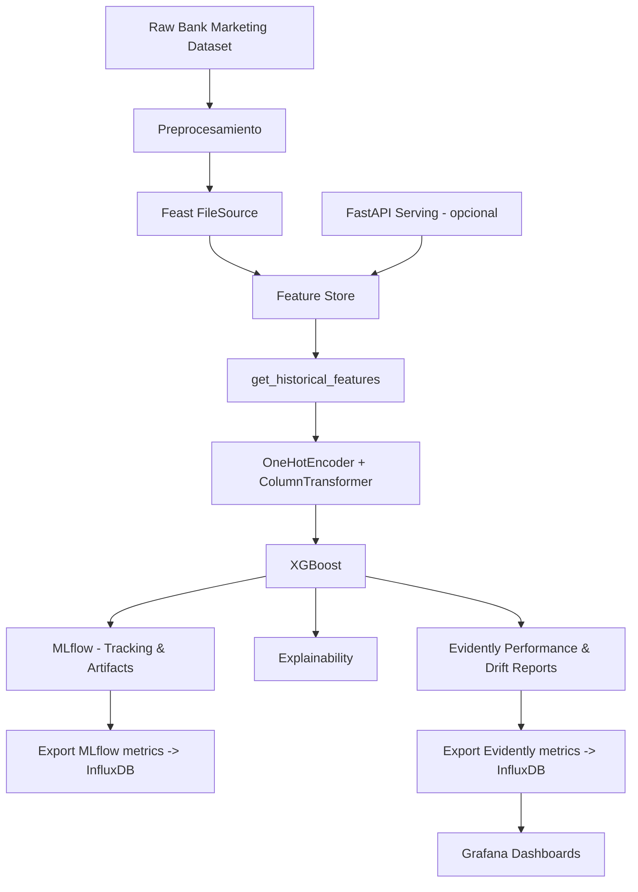

# 📈 Bank Marketing — Proyecto (Feast, MLflow, Evidently, InfluxDB, Grafana)

Este repositorio implementa un pipeline completo de *Machine Learning* aplicando el dataset **Bank Marketing**, integrando:

- Procesamiento y Feature Engineering  
- Feature Store con **Feast**
- Entrenamiento con **XGBoost (Boosting Ensemble)**  
- Experiment tracking con **MLflow (DagsHub)**  
- Monitoreo con **EvidentlyAI**  
- Exportación de métricas a **InfluxDB**  
- Dashboards en **Grafana**  
- Interpretabilidad global y local (SHAP, Feature Importance)  

---

# 1️⃣ Problema de ML y Flujo General del Proyecto

### **Problema a solucionar**
Predecir si un cliente aceptará una oferta de depósito bancario (`y = yes/no`).  
Es un problema de **clasificación binaria** con clases desbalanceadas.

### **Diagrama del flujo del proyecto (Mermaid)**




```mermaid
flowchart TD
  A[Raw Bank Marketing Dataset] --> B[Preprocesamiento (pandas)]
  B --> C[Feast FileSource (offline)]
  C --> D[Feature Store]
  D --> E[get_historical_features (Train Set)]
  E --> F[OneHotEncoder + ColumnTransformer]
  F --> G[XGBoost (Boosting Model)]
  G --> H[MLflow (DagsHub) - Tracking & Artifacts]
  G --> I[Explainability (SHAP, Feature Importance)]
  G --> J[Evidently Performance & Drift Reports]
  H --> K[Export MLflow metrics -> InfluxDB]
  J --> L[Export Evidently metrics -> InfluxDB]
  L --> M[Grafana Dashboards]
  N[FastAPI Serving - opcional] --> D
 ``` 