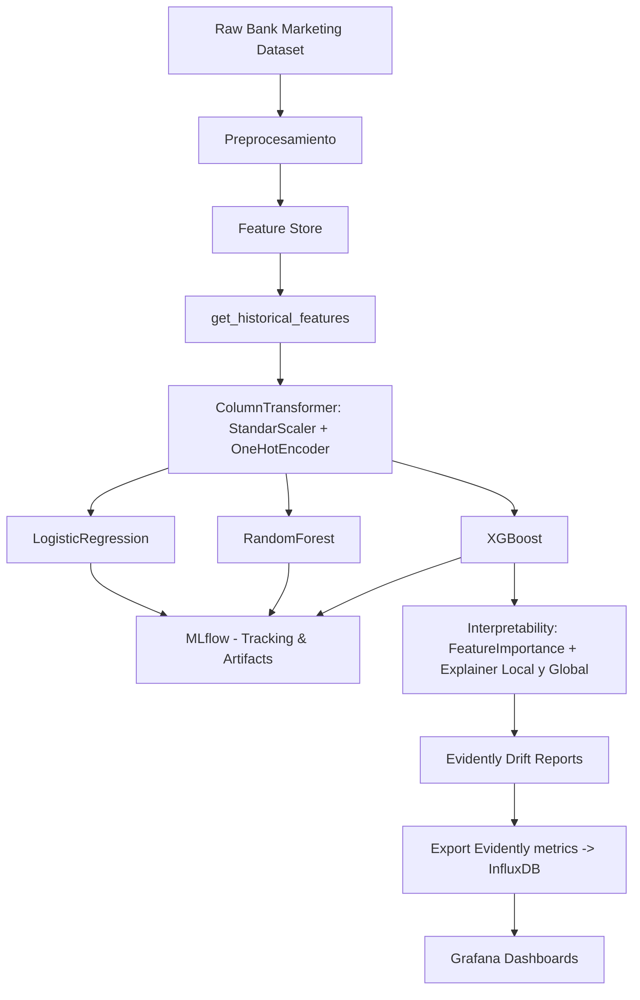
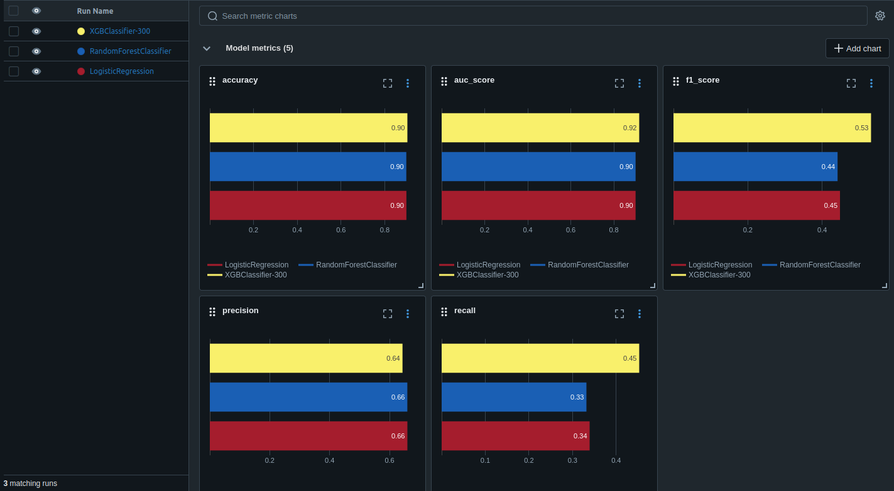
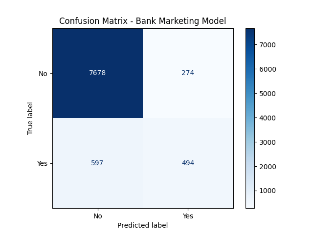
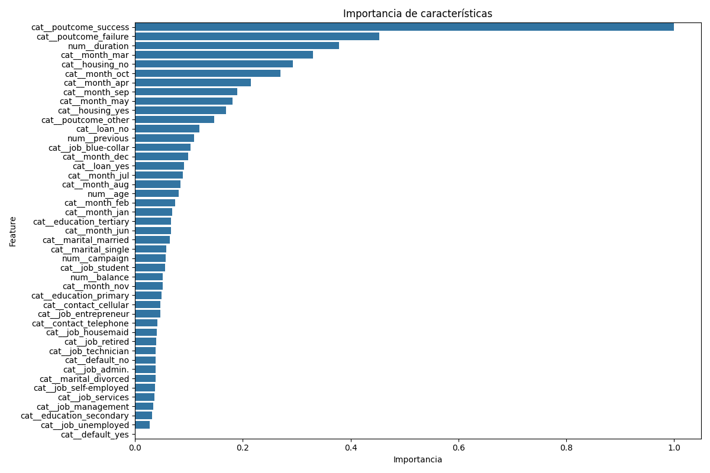
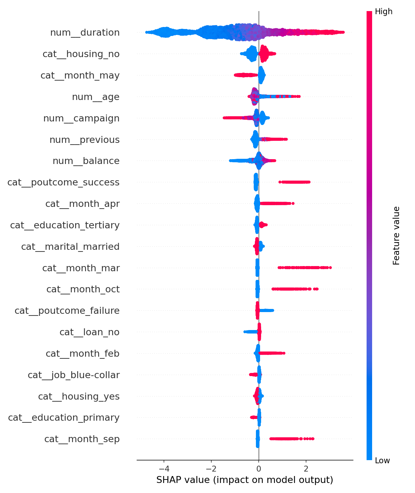

# 📈 Bank Marketing — Proyecto (Feast, MLflow, Evidently, InfluxDB, Grafana)

Este repositorio implementa un pipeline completo de *Machine Learning* aplicando el dataset **Bank Marketing**, integrando:

- Procesamiento y Feature Engineering  
- Feature Store con **Feast**
- Entrenamiento con **XGBoost (Boosting Ensemble)**  
- Experiment tracking con **MLflow (DagsHub)**  
- Monitoreo con **EvidentlyAI**  
- Exportación de métricas a **InfluxDB**  
- Dashboards en **Grafana**  
- Interpretabilidad global y local (SHAP, Feature Importance)  

---

# 1️⃣ Problema de ML y Flujo General del Proyecto

### **Problema a solucionar**
Predecir si un cliente aceptará una oferta de depósito bancario (`y = yes/no`).  
Es un problema de **clasificación binaria** con clases desbalanceadas.

### **Diagrama del flujo del proyecto (Mermaid)**

---
# 2️⃣ Dataset — Descripción y Diccionario de Datos

El dataset proviene de registros de campañas telefónicas para depósitos a plazo [Bank Marketing Dataset](https://www.kaggle.com/datasets/dhirajnirne/bank-marketing)

| Variable        | Tipo       | Descripción                |
| --------------- | ---------- | -------------------------- |
| age             | numérico   | Edad del cliente           |
| job             | categórico | Profesión                  |
| marital         | categórico | Estado civil               |
| education       | categórico | Nivel educativo            |
| default         | categórico | Crédito en default         |
| balance         | numérico   | Balance anual              |
| housing         | categórico | Tiene hipoteca             |
| loan            | categórico | Tiene préstamo personal    |
| contact         | categórico | Tipo de contacto           |
| month           | categórico | Mes de contacto            |
| duration        | numérico   | Duración última llamada    |
| campaign        | numérico   | Nº de contactos campaña    |
| pdays           | numérico   | Días desde último contacto |
| previous        | numérico   | Nº contactos previos       |
| poutcome        | categórico | Resultado previo           |
| y               | binaria    | Objetivo: `yes` / `no`     |
| customer_id     | entero     | ID asignado para Feast     |
| event_timestamp | timestamp  | Timestamp Feast            |

---
# 3️⃣ Model Card (incluir los otros modelos y conclusión del mejor modelo)
Inspirado en [Kaggle Model Cards](https://www.kaggle.com/code/var0101/model-cards).

**Model Name**: XGBoost Gradient Boosting Model  
**Version**: 1.0  
**Target**: Suscripción bancaría (y)  
**ML Task**: Clasificación binaria  
**Feature Source**: Feast (offline store, archivo/parquet)  
**Tracking**: MLflow (DagsHub)  
**Interpretability**: SHAP + Feature Importance  

📊 Performance (offline)

- XGBoost obtiene el mejor desempeño para la clase positiva, especialmente en recall y F1-score.
- Aunque los tres modelos alcanzan métricas similares en la clase 0, XGBoost sobresale:

  - Mejor recall de la clase 1

  - Mejor F1-score de la clase 1

  - Mejor macro avg (equilibrio entre clases)

  - Mejor weighted avg

  Esto significa:

  ✔ Identifica más clientes realmente interesados  
  ✔ Tiene menor cantidad de falsos negativos  
  ✔ Sería el modelo más útil en una campaña comercial real
---
# 4️⃣ Resultados
Entrenamiento con XGBoost usando features generadas por Feast, preprocesadas con OneHotEncoder para las features categóricas y StandardScaler para features numéricas.

📌 Matriz de confusión

📌 Feature Importance

📌 SHAP Summary Plot

---
# 5️⃣ Interpretabilidad: Global + Local

## 5.1 Interpretabilidad Global

### Feature Importance XGBoost
🎯 Variables más influyentes:

- duration

- housing_no

- month_may

- age

- campaign

💡 Patrones clave:

- Llamadas más largas → mucho más probabilidad de éxito.

- No tener hipoteca → aumenta aceptación.

- Haber tenido éxito en campañas pasadas → gran influencia.

- Contactar en ciertos meses (mayo especialmente) → resultados mejores.

- Contactar varias veces al mismo cliente → peor respuesta.

## 5.2 Interpretabilidad Local

### SHAP Values (force plot)
🔵 Comparación General entre Caso Negativo y Positivo
| Aspecto                       | Caso Negativo                          | Caso Positivo                                   |
| ----------------------------- | -------------------------------------- | ----------------------------------------------- |
| **Duración de llamada**       | Extremadamente corta (fuerte negativo) | Corta pero no tan penalizadora                  |
| **Mes de la llamada**         | Meses débiles                          | Meses fuertes (mayo, febrero)                   |
| **Poutcome**                  | Sin éxito                              | Éxito o fallo “reciente” que indica seguimiento |
| **Campaign (nº de llamadas)** | Pocas (ligero positivo)                | Más llamadas (ligero negativo)                  |
| **Tendencia final**           | Dominan las fuerzas negativas          | Dominan las fuerzas positivas                   |
| **f(x)**                      | **-5.18** → NO rotundo                 | **-0.73** → Cerca del umbral → Probablemente SÍ |

Los SHAP force plots permiten ver que:

- El caso negativo está dominado por falta de interés, duración mínima, y mal historial.

- El caso positivo se explica principalmente por temporada favorable y historial de interacción.

- Ambos siguen patrones coherentes con el dataset original del Bank Marketing.

---
# 6️⃣ Enlaces a Notebooks

- **EDA** → notebooks/0_eda.ipynb

- **Feast** → notebooks/1_features.ipynb

- **Train/Test + ColumnTransformer** → notebooks/2_preprocessing.ipynb

- **Tracking (MLFlow & Dagshub) + Métricas + Entrenamiento** → notebooks/3_trainning.ipynb

- **Interpretabilidad (SHAP) + Métodos globales & locales** → notebooks/4_interpretability.ipynb

- **Monitoreo con Evidently + InfluxDB + Grafana** → notebooks/5_monitoring.ipynb

---
# 7️⃣ Conclusiones del Proyecto

- Feast simplifica la gestión coherente de features.

- XGBoost mostró mejor rendimiento que modelos lineales o Random Forest.

- Evidently permite detectar drift temprano, clave en marketing donde los patrones cambian rápido.

- InfluxDB + Grafana ofrecen dashboards realtime sin overhead.

- La campaña telefónica tiene baja tasa de conversión, y los modelos lo reflejan.

- ⭐ 4. XGBoost es el mejor modelo del estudio

  - Su capacidad para manejar relaciones no lineales

  - Su manejo nativo de boosting

  - Y su robustez con desbalanceos le permiten captar mejor los patrones sutiles del dataset.