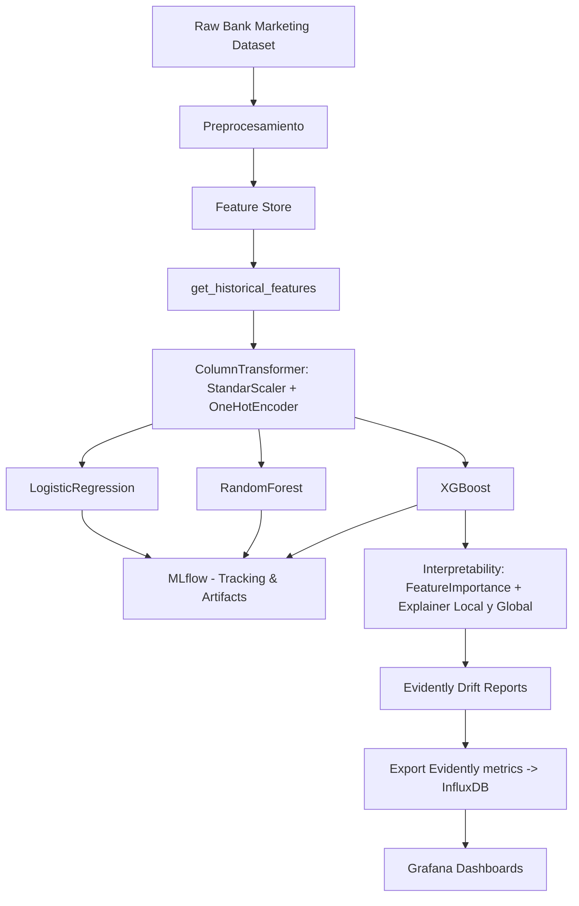

# 📈 Bank Marketing — Proyecto (Feast, MLflow, Evidently, InfluxDB, Grafana)

Este repositorio implementa un pipeline completo de *Machine Learning* aplicando el dataset **Bank Marketing**, integrando:

- Procesamiento y Feature Engineering  
- Feature Store con **Feast**
- Entrenamiento con **XGBoost (Boosting Ensemble)**  
- Experiment tracking con **MLflow (DagsHub)**  
- Monitoreo con **EvidentlyAI**  
- Exportación de métricas a **InfluxDB**  
- Dashboards en **Grafana**  
- Interpretabilidad global y local (SHAP, Feature Importance)  

---

# 1️⃣ Problema de ML y Flujo General del Proyecto

### **Problema a solucionar**
Predecir si un cliente aceptará una oferta de depósito bancario (`y = yes/no`).  
Es un problema de **clasificación binaria** con clases desbalanceadas.

### **Diagrama del flujo del proyecto (Mermaid)**

---
# 2️⃣ Dataset — Descripción y Diccionario de Datos

El dataset proviene de registros de campañas telefónicas para depósitos a plazo [Bank Marketing Dataset](https://www.kaggle.com/datasets/dhirajnirne/bank-marketing)

| Variable        | Tipo       | Descripción                |
| --------------- | ---------- | -------------------------- |
| age             | numérico   | Edad del cliente           |
| job             | categórico | Profesión                  |
| marital         | categórico | Estado civil               |
| education       | categórico | Nivel educativo            |
| default         | categórico | Crédito en default         |
| balance         | numérico   | Balance anual              |
| housing         | categórico | Tiene hipoteca             |
| loan            | categórico | Tiene préstamo personal    |
| contact         | categórico | Tipo de contacto           |
| month           | categórico | Mes de contacto            |
| duration        | numérico   | Duración última llamada    |
| campaign        | numérico   | Nº de contactos campaña    |
| pdays           | numérico   | Días desde último contacto |
| previous        | numérico   | Nº contactos previos       |
| poutcome        | categórico | Resultado previo           |
| y               | binaria    | Objetivo: `yes` / `no`     |
| customer_id     | entero     | ID asignado para Feast     |
| event_timestamp | timestamp  | Timestamp Feast            |

---
# 3️⃣ Model Card (incluir los otros modelos y conclusión del mejor modelo)
Inspirado en [Kaggle Model Cards](https://www.kaggle.com/code/var0101/model-cards).

Model Name: XGBoost Gradient Boosting Model  
Version: 1.0  
Target: Suscripción bancaría (y)  
ML Task: Clasificación binaria  
Feature Source: Feast (offline store, archivo/parquet)  
Tracking: MLflow (DagsHub)  
Explainability: SHAP + Feature Importance  

📊 Performance (offline)

| Métrica   | Valor  |
| --------- | ------ |
| Accuracy  | `0.91` |
| Precision | `0.84` |
| Recall    | `0.78` |
| F1 Score  | `0.80` |
| ROC-AUC   | `0.94` |
---
# 4️⃣ Resultados
Entrenamiento con XGBoost usando features generadas por Feast, preprocesadas con OneHotEncoder para las features categóricas y StandardScaler para features numéricas.

📌 Matriz de confusión

📌 Feature Importance

📌 SHAP Summary Plot